# IntegrationSolution · Transport support monitoring

**A modular WPF desktop application that reconciles SAP waybills with Wialon GPS tracking.** It runs mileage audits, calculates
fuel and cost totals, builds driver and vehicle analytics, and writes Excel reports.

[](https://github.com/METACMETAHA/IntegrationSolution/actions/workflows/windows-ci.yml)


[](https://prismlibrary.com/)
[](https://mahapps.com/)


[Features](#features) · [Screenshots](#screenshots) · [Architecture](#architecture-at-a-glance) ·
[Getting started](#getting-started) · [Documentation](docs/README.md) · [Contributing](#contributing)


## Why

A transport service gets two views of its fleet:

* **SAP waybills**: what drivers and dispatchers recorded.
* **Wialon**: what the GPS trackers actually saw.

Comparing them by hand, vehicle by vehicle, takes days. This app loads the SAP export, pulls the tracks from Wialon, matches
the vehicles by license plate and shows where the numbers disagree. It also turns the waybills into cost totals and fleet
analytics.

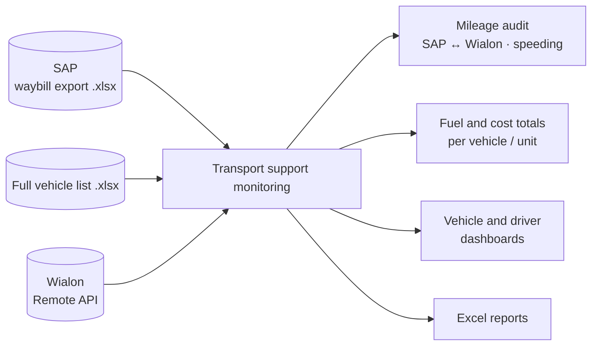

It was built for the fleet of DTEK Networks (*ДТЕК Мережі*), a Ukrainian electricity distribution system operator. See the
[product overview](docs/overview.md) for the full picture.

## Features

* 🔍 **Mileage audit (SAP ↔ Wialon).** For any period it reports the per-vehicle difference in mileage and trips against a
  tolerance you set. It also lists vehicles that have waybills but no tracks, and tracks but no waybills.
* 🚨 **Speeding analysis.** Every Wialon speeding event, with time, address, duration and speed, shown on a gauge.
* ⛽ **Transport support costs.** Fuel by type at prices you enter, plus mileage and engine hours, per vehicle and per
  structural unit. Works offline.
* 📊 **SAP summary dashboards.** Top and bottom 10 vehicles, six driver metrics, daily mileage and working days per driver
  ([LiveCharts](https://lvcharts.net/)).
* 📑 **Excel reports.** Three sheets with frozen headers, collapsible trips grouped by vehicle, and colour-coded
  discrepancies. Office does not need to be installed.
* 🧩 **Configurable input format.** Rename the expected SAP columns or reset them to the defaults. Files are checked before
  you continue.
* 🌐 **Three UI languages, switched live.** English (default), Ukrainian and Russian, remembered for each user.
  See [localization](docs/localization.md).
* 🔌 **Wialon integration.** A connection toggle with session keep-alive and a guided token setup.

## Screenshots

| Settings: interface language | Settings: configurable Excel headers |
| --- | --- |
|  |  |

### Localization

The same screen in each language. The language switches at runtime, with no restart.

| English (default) | Українська | Русский |
| --- | --- | --- |
|  | 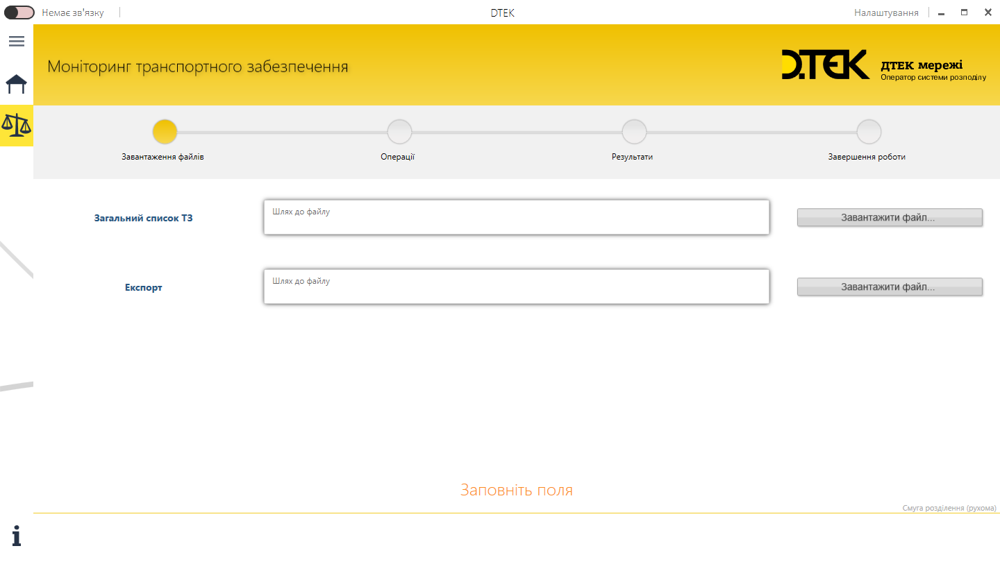 | 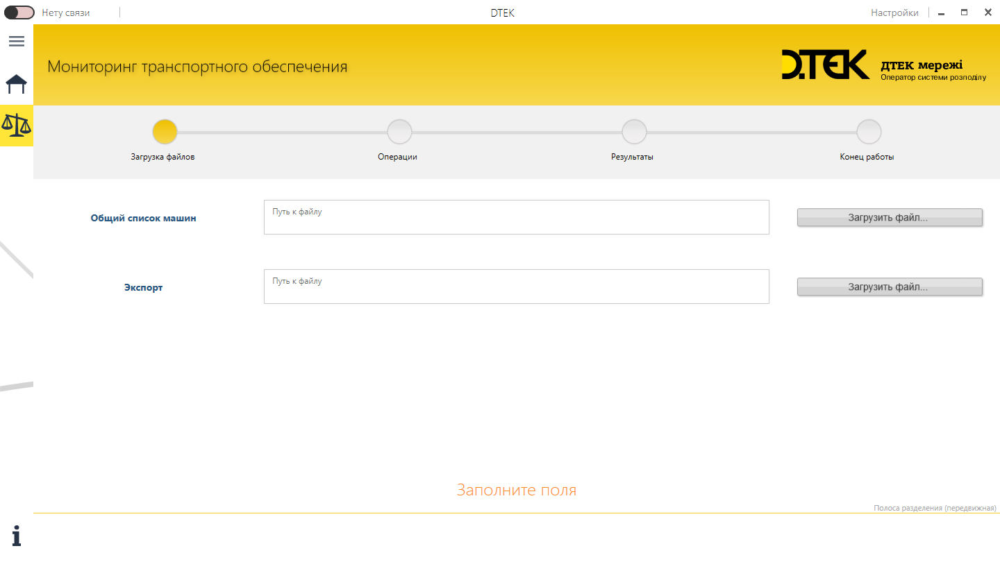 |

The screenshots above are captured from the running app by [CI](.github/workflows/readme-screenshots.yml).

### Demo

.gif)

<details>
<summary><b>More screenshots</b> (with real data, from the original Russian UI)</summary>

**Loading files.** The start step checks the Excel files and their SAP headers. If a file does not fit, you cannot go to the
next step.


**SAP summary.** Top 10 vehicles by mileage and by average trip, with a filter by vehicle type.

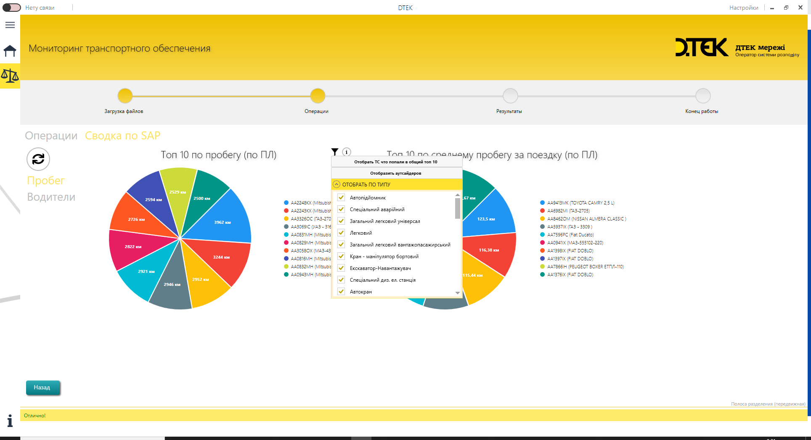

**SAP summary.** The drivers chart, and one driver's daily mileage, working days and statistics.

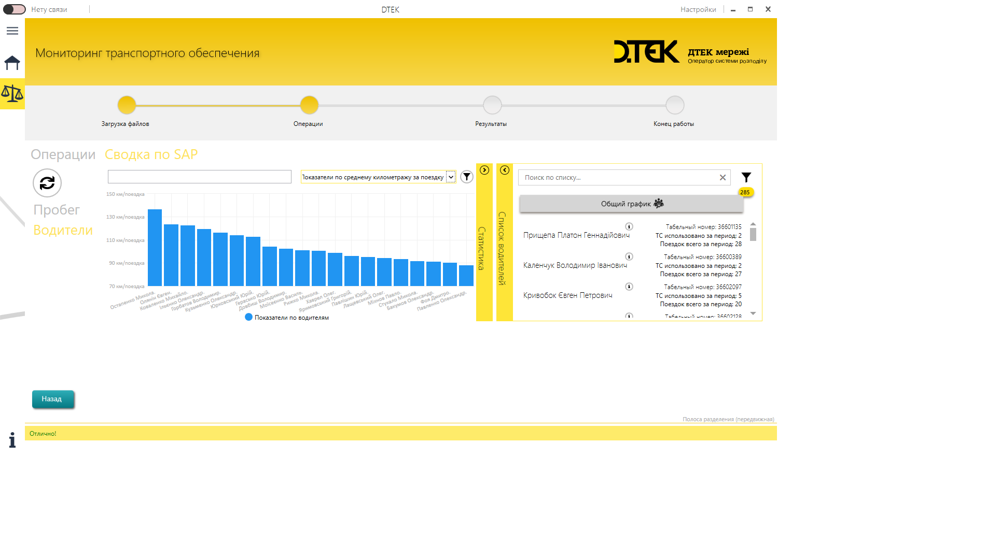
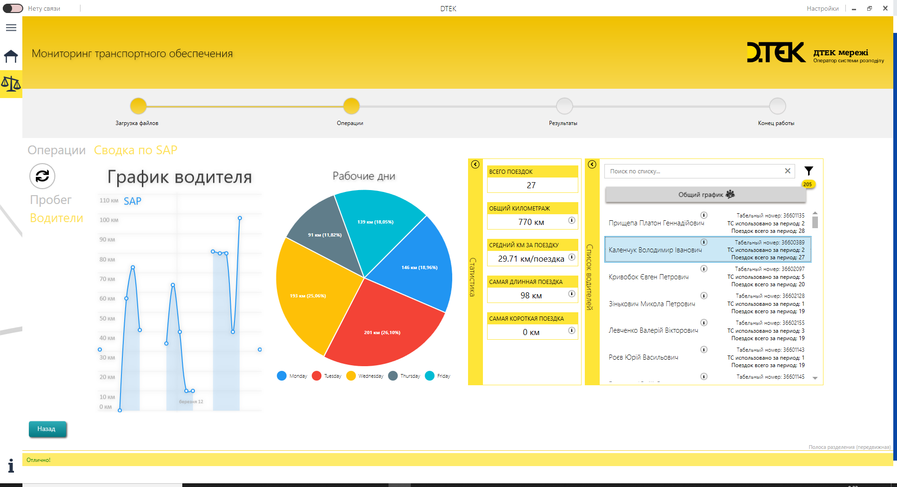

**Results.** The summary grid, and the per-vehicle comparison of SAP and Wialon mileage with details and violations.

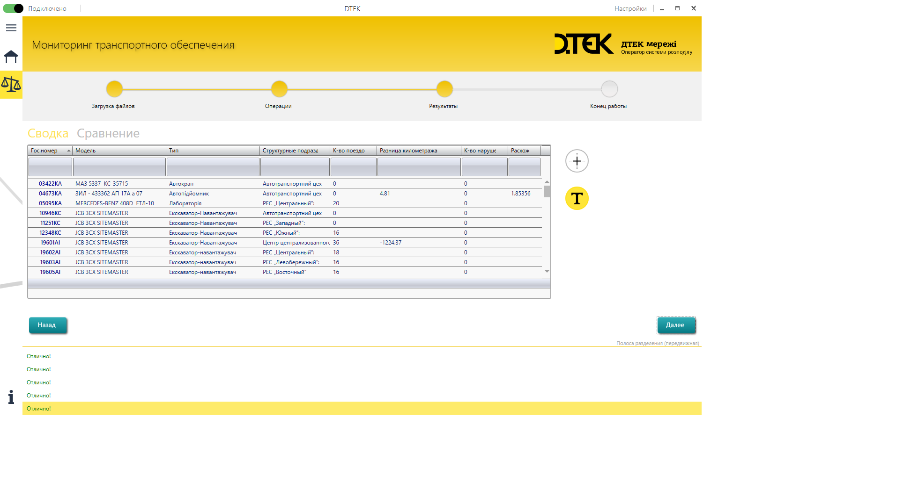
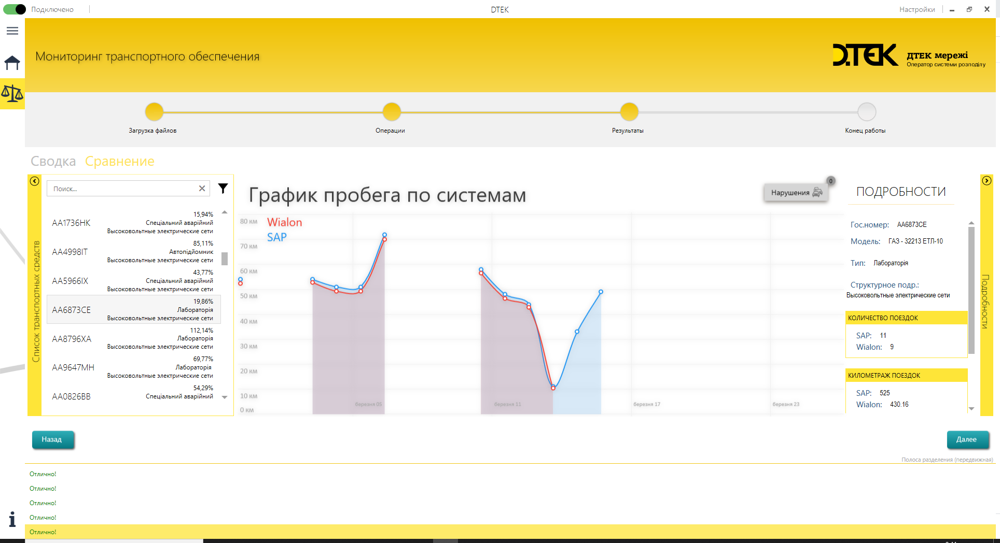

**Mileage audit report.** The rows are grouped by vehicle, and the header stays at the top while scrolling.

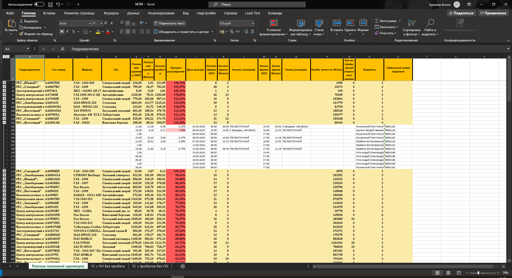

**Settings.** Your own header names for the Excel files, with a restore to the factory defaults, and the Wialon token.

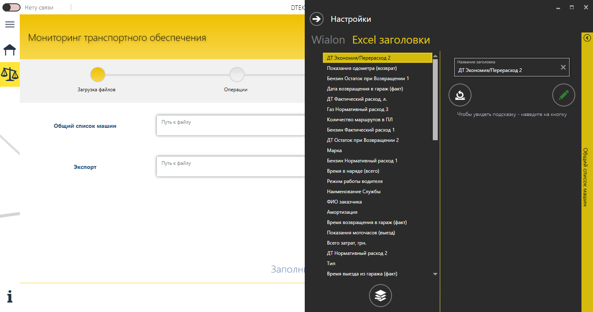
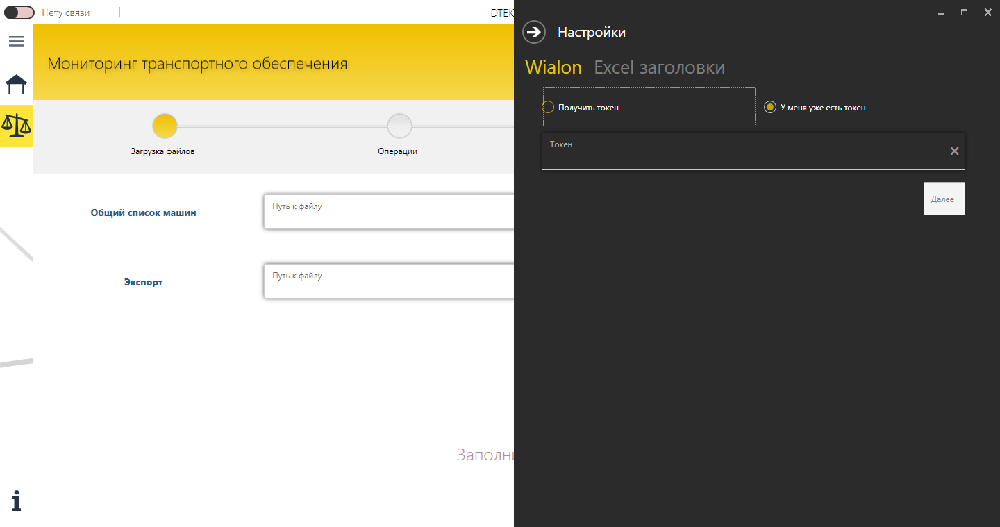

</details>

## Architecture at a glance

IntegrationSolution is a **modular application**:

* **Composition: [Prism](https://prismlibrary.com/).** It provides modules, dependency injection with **Unity**, an event
  aggregator and a region adapter for flyouts.
* **UI: [MahApps.Metro](https://mahapps.com/).** It provides the Metro window, hamburger menu, flyouts and dialogs.
* **Pattern: strict MVVM.**

Each functional area is a Prism module that registers its own views, view models and services:

| Prism module | Project | Provides |
| --- | --- | --- |
| `InfrastructureModule` | `Integration.Infrastructure` | Wizard host (header, steps, status log), Home, Help |
| `ModuleGUIModule` | `Integration.ModuleGUI` | The four wizard steps: Loading files → Operations → Results → Finish |
| `FlyoutsModule` *(on demand)* | `Integration.Flyouts` | The Settings flyout: language, Wialon token, Excel headers |
| `DialogsModule` | `IntegrationSolution.Dialogs` | Metro dialogs with typed results: period, fuel prices, token help |
| `WialonModule` | `WialonBase` | Wialon Remote API client and JSON → entity mapping |
| `IntegrationSolutionExcelModule` | `IntegrationSolution.Excel` | Reads the SAP files and writes the reports ([EPPlus](https://github.com/EPPlusSoftware/EPPlus)) |
| `CommonModule` | `IntegrationSolution.Common` | Shared configuration, `ViewModelBase`, events |

| Layer | Technology |
| --- | --- |
| UI | WPF on .NET Framework 4.6.1, MahApps.Metro 2.0 and IconPacks, LiveCharts 0.9, custom controls (`DsxGridCtrl` data grid, wizard progress bar) |
| Composition | Prism 7.1, Unity 5, `IEventAggregator`, a `FlyoutsControl` region adapter |
| Integration | EPPlus 4.5 (Excel), Newtonsoft.Json (Wialon Remote API over HTTP) |
| Cross-cutting | `IntegrationSolution.Localization` (resx, live switching), log4net, ToastNotifications |
| Quality | MSTest and Moq; GitHub Actions on Windows with a UI Automation smoke test |

The [architecture docs](docs/architecture.md) cover the solution map, startup sequence, UI composition and data flow, with diagrams.

## Getting started

**Try a build without compiling.**

1. Open the latest green [Windows CI run](https://github.com/METACMETAHA/IntegrationSolution/actions/workflows/windows-ci.yml).
2. Download the `IntegrationSolution-Release` artifact. You need to be signed in to GitHub.
3. Unzip it and run `IntegrationSolution.ShellGUI.exe`.

**Build from source** on Windows with Visual Studio 2022 (the *.NET desktop development* workload):

```powershell
./build/Install-TargetingPacks.ps1         # once, elevated: the .NET Framework 4.0 / 4.6.1 targeting packs
nuget restore IntegrationSolution.sln
msbuild IntegrationSolution.sln -m -p:Configuration=Release
.\IntegrationSolution.ShellGUI\bin\Release\IntegrationSolution.ShellGUI.exe
```

**Use it.**

1. Load the *Full vehicle list* and the SAP waybill *Export*. *Help → Sample waybill headers* shows the expected columns.
2. To use the Wialon features, add a Wialon token in *Settings → Wialon*.

The [user guide](docs/user-guide.md) walks through every step.

## Documentation

| | |
| --- | --- |
| [Product overview](docs/overview.md) | Purpose, key terms, features |
| [User guide](docs/user-guide.md) | The wizard step by step, the report colour legend, settings, troubleshooting |
| [Architecture](docs/architecture.md) | Prism modules, startup, UI composition, data flow, technical debt |
| [Localization](docs/localization.md) | How live language switching works; adding strings and languages |
| [Development](docs/development.md) | Build, tests, CI, UI automation, screenshots |

## Project status

The app started as an internal tool (2019) and is being modernized as an open-source project.

* Done:
  * runtime localization (en/uk/ru);
  * a clean-machine build;
  * Windows CI with an end-to-end UI test;
  * screenshots generated from the app;
  * these docs.
* Next steps, listed under [technical debt](docs/architecture.md#known-technical-debt):
  * SDK-style projects on .NET Framework 4.8;
  * protected storage for the Wialon token and user settings;
  * removing unused projects.

## Contributing

Issues and pull requests are welcome. See [CONTRIBUTING.md](CONTRIBUTING.md). You don't need a Windows machine: every pull request is built, tested and smoke-tested on
a Windows runner, and the app and screenshots are uploaded as artifacts.

1. Read [development](docs/development.md). For any UI text, also read [localization](docs/localization.md): every string goes
   through `Strings.resx` in all three languages, and the tests enforce it.
2. Keep pull requests focused, and make sure **Windows CI** is green.
3. UI changes: a maintainer adds the `update-screenshots` label, and CI re-captures the screenshots.
