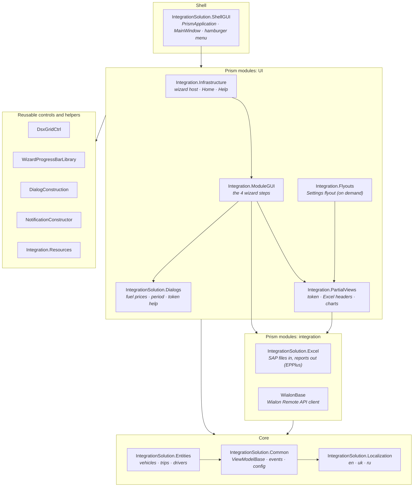
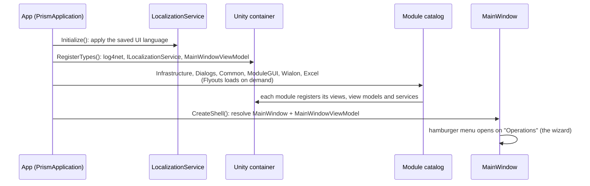
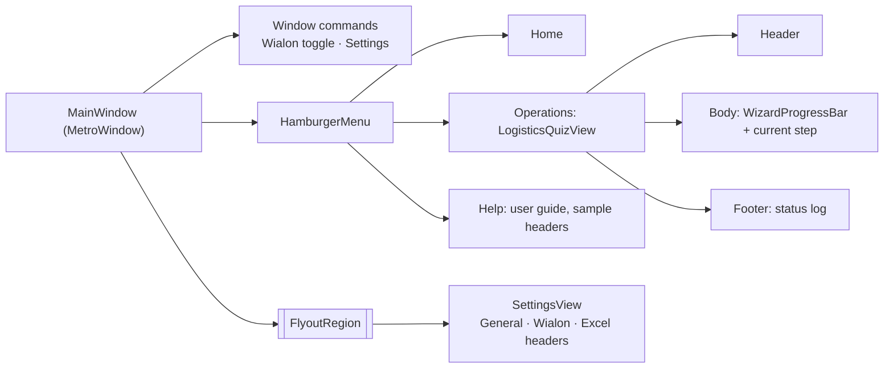
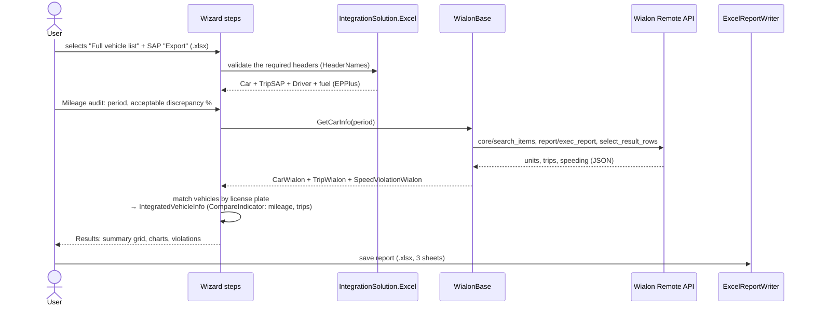

# Architecture

IntegrationSolution is a **modular WPF application**:

* **Composition.** [Prism 7](https://prismlibrary.com/) with a [Unity](https://github.com/unitycontainer/unity) container. Each feature area is a Prism module that registers its own views and services.
* **UI.** [MahApps.Metro](https://mahapps.com/): metro window, hamburger menu, flyouts and dialogs.
* **Charts.** [LiveCharts](https://lvcharts.net/).
* **Excel.** [EPPlus](https://github.com/EPPlusSoftware/EPPlus) reads and writes Excel files; Office is not required.
* **Notifications.** [ToastNotifications](https://github.com/rafallopatka/ToastNotifications).
* **Logging.** [log4net](https://logging.apache.org/log4net/).

The UI follows MVVM throughout.

## Solution map

| Project | Role |
| --- | --- |
| `IntegrationSolution.ShellGUI` | Entry point (`WinExe`). It holds the Prism bootstrap, the main window, the Wialon connection toggle and the session keep-alive. |
| `Integration.Infrastructure` | Hosts the wizard: `LogisticsQuizView` with its header, body and footer. `ConfigurationData` lists the steps. It also contains Home and Help. |
| `Integration.ModuleGUI` | The wizard steps (Loading files → Operations → Results → Finish) and `CommonModuleData`, the state the steps share. |
| `Integration.Flyouts` | The Settings flyout with three tabs: General (language), Wialon (token) and Excel headers. It loads on demand. |
| `Integration.PartialViews` | Views reused across screens: token entry, header editor, mileage and speed charts. |
| `IntegrationSolution.Dialogs` / `DialogConstruction` | MahApps metro dialogs with typed, `Task`-based results (`IDialogManager.ShowDialogAsync<T>`). |
| `IntegrationSolution.Excel` | Reads SAP exports and writes the reports, with header names the user can configure (`HeaderNames`). |
| `WialonBase` | Wialon Remote API over HTTP (`token/login`, `core/search_items`, `report/exec_report`, …) and JSON → entity mapping. |
| `IntegrationSolution.Entities` | Domain model: `Car`, `TripSAP`, `Driver`, `CarWialon`, `TripWialon`, `SpeedViolationWialon`, `IntegratedVehicleInfo`, `CompareIndicator<T>`. |
| `IntegrationSolution.Common` | `ViewModelBase`, Prism events, converters, `AppConfiguration`, `SerializeConfigDTO` (user settings). |
| `IntegrationSolution.Localization` | Runtime language switching. See [localization.md](localization.md). |
| `DsxGridCtrl` | A custom data grid with a filter row, sorting, footers and frozen panes. It shows the results and the violations. |
| `WizardProgressBarLibrary`, `NotificationConstructor` | The step progress bar of the wizard, and a wrapper over ToastNotifications. |
| `Integration.Setup` | MSI installer (Visual Studio Installer Projects). |

## Startup

## UI composition

* **Navigation.**
  * Top level: each hamburger menu item carries its view in `Tag`.
  * Wizard: `ConfigurationData.Steps` lists the step pairs. `BodyViewModel` awaits `MoveNext()` on the current step, showing a progress dialog, and advances only when the step returns `true`.
* **Communication.** Prism `IEventAggregator` events:
  * `WialonConnectionEvent`;
  * `CanGoNextUpdateEvent`, which enables the Next button;
  * `SubmitFinishedEvent`;
  * `StatusUpdateEvent`, which feeds the footer log.
* **Feedback.**
  * Long operations show MahApps progress dialogs.
  * Results appear as toast notifications in the bottom-right corner.
  * Every status message is also written to log4net (`log\log-file.log`).

## Data flow: mileage audit

The other operation, **Transport support costs**, needs no Wialon connection. It asks for fuel prices, totals the fuel, costs, mileage
and engine hours from the waybills, and writes them back into the *Full vehicle list* workbook.

## Persisted state

| What | Where |
| --- | --- |
| UI language | `%LocalAppData%\IntegrationSolution\ui-language.txt` |
| Custom Excel header names, the default path of the vehicle list | `sys.dat` (binary-serialized `SerializeConfigDTO`) in the working directory |
| Wialon API URL and access token | `IntegrationSolution.ShellGUI.exe.config` (`appSettings`). *Settings → Wialon* writes the new token there. |
| Logs | `log\log-file.log`, rolling, 10 MB × 5 (log4net, configured in `App.config`) |

## Known technical debt

The list is kept short and honest, so contributors know where to start:

* Legacy project format: `packages.config`, and .NET Framework 4.0 to 4.6.1 targets. Moving to SDK-style projects and .NET Framework 4.8
  would simplify the build.
* The MahApps.Metro packages are mixed `2.0.0-alpha` builds.
* `sys.dat` uses `BinaryFormatter`. The Wialon token lives in the application `.config`. Both should move to protected,
  per-user storage.
* The mileage audit runs a fixed Wialon report: resource 725, template 1, reading the `Поездки` and `Превышение скорости` tables.
  A different Wialon account has to provide a matching template.
* `IntegrationSolution.Analytics` (k-means), `IntegrationSolution.Logger`, `IPAddressUserControl` and `ProgressRing` are not used by
  the app. `IntegrationSolution.Logger` is not in the solution.
* The `Excel.Tests` and `Wialon.Tests` integration tests need real accounts or files.
