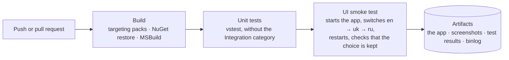

# Development

## Build locally (Windows)

Requirements:

* Windows 10 or 11 with **Visual Studio 2022** and the *.NET desktop development* workload (MSBuild and NuGet included).
* The **.NET Framework 4.0 and 4.6.1 targeting packs**. Visual Studio 2022 no longer ships them; to install them from
  Microsoft's official NuGet packages, run this once from an elevated PowerShell:

  ```powershell
  ./build/Install-TargetingPacks.ps1
  ```

Build:

```powershell
nuget restore IntegrationSolution.sln
msbuild IntegrationSolution.sln -m -p:Configuration=Release
.\IntegrationSolution.ShellGUI\bin\Release\IntegrationSolution.ShellGUI.exe
```

`Integration.Setup` (`.vdproj`, the MSI installer) is skipped by MSBuild. To build it, open the solution in Visual Studio
with the *Microsoft Visual Studio Installer Projects* extension installed.

## Tests

The tests are MSTest projects in `IntegrationSolution.Tests`:

| Folder | Covers |
| --- | --- |
| `Localization.Tests` | Resource parity across en/uk/ru, placeholders, XAML keys, no hard-coded Cyrillic, language switching and persistence |
| `Configuration.Tests` | No Wialon token (or other 64+ hex-digit value) in any `.cs` or `.config` file; `App.config` keeps an empty `Token` key |
| `Helpers.Tests` | Placeholder for the license-plate converter. It has no assertions yet. |
| `Excel.Tests`, `Wialon.Tests` | Tagged `Integration`: they need a live Wialon account or files on a developer machine. `Wialon.Tests` read the token from the `WIALON_TOKEN` environment variable and are inconclusive without it |

```powershell
vstest.console.exe IntegrationSolution.Tests\bin\Release\IntegrationSolution.Tests.dll /TestCaseFilter:"TestCategory!=Integration"
```

## No Windows machine? Use CI

Every pull request is built and tested on a GitHub-hosted Windows runner. You can work from macOS or Linux without a local
Windows setup:



| Workflow | Trigger | What it does |
| --- | --- | --- |
| [`windows-ci.yml`](../.github/workflows/windows-ci.yml) | push to `master`, every pull request, manual | Build, unit tests, UI smoke test. Uploads the ready-to-run app (`IntegrationSolution-Release`), a screenshot of every step, `.trx` results and the MSBuild binlog. |
| [`readme-screenshots.yml`](../.github/workflows/readme-screenshots.yml) | the `update-screenshots` label on a pull request, or manual | Re-captures `docs/screenshots/*.png` from the running app and commits them to the pull request branch. Remove and re-add the label to run it again. |

Both workflows share the composite action [`.github/actions/build-solution`](../.github/actions/build-solution/action.yml).

## UI automation scripts

The scripts in `build/` drive the real application through **Windows UI Automation**. They use no extra tools; they run in
Windows PowerShell 5.1.

| Script | Purpose |
| --- | --- |
| `UiAutomation.ps1` | Shared helpers: start and stop the app, find elements, select a language, take screenshots, dump the automation tree |
| `Invoke-UiSmokeTest.ps1` | The end-to-end language switching test that CI runs |
| `Capture-ReadmeScreenshots.ps1` | Fixed-size window screenshots for the README and these docs |
| `Install-TargetingPacks.ps1` | Installs the missing .NET Framework reference assemblies |

The scripts find controls by `AutomationProperties.AutomationId` (`SettingsButton`, `LanguageSelector`). Keep those ids when
you edit the views. Expected texts are read from the `.resx` files, so the scripts stay ASCII-only.

## Conventions

* MVVM with Prism. Views stay free of logic; view models derive from `ViewModelBase`.
* All UI text goes through resources. See [localization.md](localization.md).
* Data contracts are not translated: SAP column headers and Wialon field names.
* Tests that need external systems get `[TestCategory("Integration")]`.
