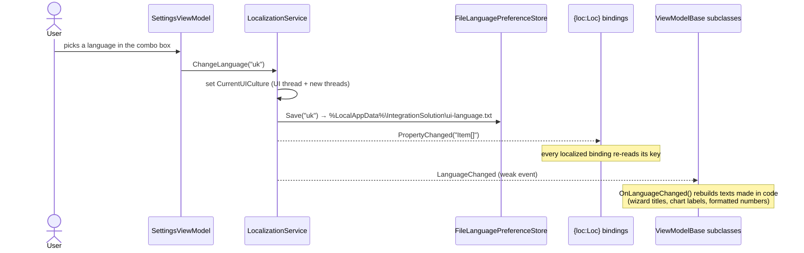

# Localization

The UI is available in **English** (default), **Ukrainian** and **Russian**. You pick the language under
**Settings → General → Interface language**. The UI switches at once, with no restart, and the choice is remembered
for each Windows user.

| English (default) | Українська | Русский |
| --- | --- | --- |
|  |  |  |

## How a switch propagates

* **Startup.** `App.OnStartup` calls `LocalizationService.Instance.Initialize()` before any window is created.
  It applies the saved language. If no language is saved, or the saved one is unknown or unreadable, it falls back to English.
* **Persistence.** The choice is stored in a one-line text file, not in `user.config`. On .NET Framework a broken
  `user.config` makes `ConfigurationManager` fail for the whole app; a broken language file only means English.
  The file is written to a temporary file first and then swapped in.
* **Scope.** Only `CurrentUICulture` changes. Number and date formats, and the parsing of SAP and Excel data, follow the Windows
  regional settings. Data contracts are deliberately left untranslated: SAP column headers and Wialon report labels.

## Using it

| Where | How |
| --- | --- |
| XAML text | `xmlns:loc="clr-namespace:IntegrationSolution.Localization.Markup;assembly=IntegrationSolution.Localization"`, then `Text="{loc:Loc Shell_SettingsButton}"` |
| XAML text with values | `{loc:LocFormat Operations_KmFormat, Arg0={Binding TotalMileageAtAll}, FallbackValue='-'}`. Use it instead of `StringFormat` with hard-coded words. |
| C# | Read the strongly typed `Strings.Key` or call `ILocalizationService.Format(key, args)`. A view model overrides `ViewModelBase.OnLanguageChanged()` to rebuild its texts. |
| Other classes | `LanguageChangedEventManager.AddHandler(...)` gives a weak subscription, so the subscriber is never kept alive. |
| DI | `ILocalizationService` is registered in the Prism container as `LocalizationService.Instance`. |

## Adding a string or a language

1. Add the key to `IntegrationSolution.Localization/Resources/Strings.resx`. Visual Studio regenerates `Strings.Designer.cs`.
2. Add the same key to `Strings.uk.resx` and `Strings.ru.resx`. Keys are named `Area_Name`, for example `Results_SummaryTab`.
3. The tests in `IntegrationSolution.Tests/Localization.Tests` fail in these cases:
   * a translation is missing;
   * the `{0}` placeholders differ between languages;
   * XAML uses a key that does not exist;
   * Cyrillic text is hard-coded in XAML.

To add a language, add `Strings.<culture>.resx` and list the language in `LocalizationService.CreateDefaultLanguages()`.
The setup project already ships the localized satellite folders (`uk\`, `ru\`, …).
