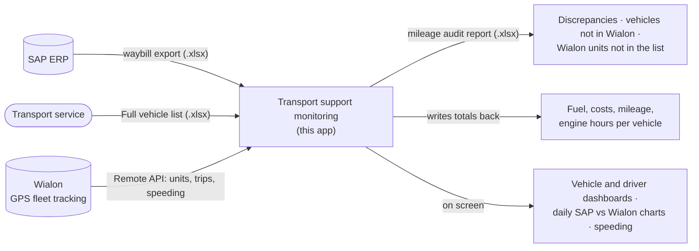

# Product overview

**Transport support monitoring** (*Мониторинг транспортного обеспечения*) is a Windows desktop app for a company's
transport service. It answers three questions about the vehicle fleet:

1. **Do the waybills match reality?** It compares the mileage and trips recorded on SAP waybills with the GPS tracks in
   Wialon, vehicle by vehicle, and flags discrepancies and speeding.
2. **What does the fleet cost?** It totals fuel by type (at prices you enter), costs, mileage and engine hours per vehicle and
   per structural unit.
3. **Who drives how much?** It builds dashboards of vehicles and drivers from the waybills: top and bottom 10, productivity,
   working days, longest and shortest trips.

It was built for the fleet of DTEK Networks (*ДТЕК Мережі*), a Ukrainian electricity distribution system operator, and the shell
carries its branding.

* **SAP input.** Any SAP waybill export works, because the column names are configurable.
* **Wialon.** The audit expects a specific report template in the Wialon account. See
  [technical debt](architecture.md#known-technical-debt).

## Context

## Key concepts

| Term | Meaning |
| --- | --- |
| **Waybill** (*путевой лист*, ПЛ) | The document of one vehicle trip or shift: driver, departure and return times, odometer and engine-hour readings, and fuel issued, used and remaining. It is kept in SAP. |
| **Export** | The waybills for a period, exported from SAP to Excel. The app reads it by column name. |
| **Full vehicle list** | An Excel register of the vehicles to analyse: license plate, type, model, service and structural unit. |
| **Wialon** | A GPS fleet-tracking platform. Each tracked vehicle is a *unit*. The app logs in with an access **token**. |
| **Discrepancy %** | The tolerance for differences between SAP and Wialon mileage. You enter it for each audit, for example 3.5. |
| **Header names** | The column names the app expects in the Excel files. You can edit them in Settings when the SAP layout changes. |

Vehicles are matched between SAP and Wialon by **license plate**. Plates are normalized first: Latin lookalike letters are mapped
to Cyrillic, and spaces, dots and dashes are removed.

## Features

* **Mileage audit (SAP ↔ Wialon).**
  * Period presets: today, this week, this month, or custom dates.
  * A simple or a detailed report, with an adjustable tolerance.
  * Colour-coded results.
  * Separate lists of vehicles not found in Wialon and of Wialon units missing from the vehicle list.
* **Speeding analysis.** It lists every violation from Wialon with time, address, duration, speed and limit, and shows each one on a speed gauge.
* **Transport support costs.**
  * Fuel consumption and cost for diesel, gasoline and LPG; the prices are entered on the spot.
  * Mileage and engine hours per vehicle and per structural unit, written into the vehicle list.
  * Works offline.
* **SAP summary dashboards.**
  * Top and bottom 10 vehicles by mileage and by average trip.
  * Six driver metrics, and a daily mileage and weekday breakdown for each driver.
  * Works offline.
* **Excel reports.**
  * Three sheets: a frozen header on the main sheet, trips grouped by vehicle (collapsible) and colour highlighting.
  * Sheet and column names follow the UI language.
  * Excel does not need to be installed.
* **Configurable input format.**
  * Rename the expected column names, then reset one or all of them to the factory defaults.
  * Files are checked before you can continue, and the error lists the required columns.
* **Wialon integration.**
  * A connection toggle in the title bar, with a session keep-alive.
  * A guided token setup.
* **Three UI languages.** English, Ukrainian and Russian, switched live. See [localization.md](localization.md).
* **Built-in help.** A user guide (PDF) and a sample waybill file that shows the expected columns.

Continue with the [user guide](user-guide.md) or the [architecture](architecture.md).
