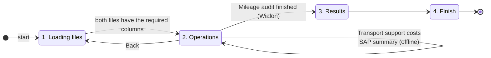

# User guide

A short English version of the built-in guide. To open the original Russian PDF, go to **Help → User guide**.

## Requirements

* Windows with .NET Framework 4.6.1 or later. Windows 10 and 11 already have it.
* The Wialon features need an internet connection, a Wialon access token, and a Wialon account that provides the report the
  audit uses. See [architecture → technical debt](architecture.md#known-technical-debt).

## The screen

* **Top left.** The Wialon connection toggle shows *No connection* or *Connected*. While connected, the app renews the session
  every 14 minutes.
* **Top right.** **Settings**.
* **Left.** The menu: **Home**, **Operations** (the wizard; selected at start) and **Help**.
* **Bottom.** A status log of what happened. Hover over most buttons to see a tooltip.

## The Operations wizard

### 1. Loading files

Choose two Excel files (`.xlsx` / `.xls`):

| Field | File |
| --- | --- |
| **Full vehicle list** | The vehicles to analyse. It needs at least these columns: license plate, type, service and model. |
| **Export** | The waybills exported from SAP. It needs at least the license plate and total mileage columns. |

**Next** appears once both files exist. The app then checks the column names against **Settings → Excel headers**. If a column
is missing, it names the file and the columns and stays on this step. To see the expected names, go to
**Help → Sample waybill headers**.

> Tip: the vehicle list rarely changes. Set its default path under **Settings → Excel headers → Full vehicle list**.

### 2. Operations

**Operations** tab:

* **Transport support costs** runs offline.
  1. It asks for fuel prices (diesel, gasoline, LPG).
  2. It totals fuel consumption and cost, mileage and engine hours for each vehicle and each structural unit.
  3. It writes the totals **into the Full vehicle list file** and saves it.
* **Mileage audit** needs Wialon.
  1. Choose a period: today, this week, this month or custom.
  2. Choose a simple or a **detailed** report.
  3. Enter the acceptable discrepancy %.
  4. The app fetches each vehicle's trips and speeding from Wialon, compares them with the waybills, and saves the Excel
     report. Then **Next** leads to the results.

**SAP summary** tab: press **Initialize** to get dashboards built from the waybills only.

* **Mileage**: pie charts of the top 10 vehicles by mileage and by average km per trip. You can show the bottom 10,
  highlight vehicles that are in both lists, and filter by vehicle type.
* **Drivers**: a chart of up to 20 drivers by mileage, productivity, average trip, number of trips, longest trip or
  shortest trip, with statistics tiles and a searchable list. Select a driver to see their daily mileage and working days.

### 3. Results

* **Summary** is a grid with a filter and sorting on every column. It shows each vehicle's differences in trips and mileage,
  the number of speeding violations and the discrepancy.
* **Comparison** is filled for a detailed report only. Pick a vehicle to see the daily SAP and Wialon mileage chart, its details,
  and **Violations**: every speeding event with a speed gauge.

### 4. Finish

You are done and can close the app.

## Help

**User guide** and **Sample waybill headers** copy the PDF guide and the sample Excel file to your *Downloads* folder and open
it in Explorer.

## The mileage audit report

The report is an Excel workbook, sorted by discrepancy. The header row is frozen.

| Sheet | Contents |
| --- | --- |
| **Odometer reading difference** | One row per vehicle with SAP and Wialon mileage, trips, discrepancy % and speeding. In the detailed report, each vehicle has collapsible trip rows with the SAP and Wialon times and locations. |
| **Waybill but no mileage** | Vehicles that have waybills but are not found in Wialon, or have no track. The tracker may be missing or broken. |
| **Mileage but no waybill** | Vehicles that are tracked in Wialon but have no waybills. |

| Cell | Colour | Meaning |
| --- | --- | --- |
| Discrepancy % | 🟨 yellow | Over the tolerance, and Wialon km > SAP km. The waybill values may be too low. |
| Discrepancy % | 🟥 red | Over the tolerance, and SAP km > Wialon km. The tracker may be faulty, or the waybill values too high. |
| Speeding violations | 🟥 red | The number of violations, when there are any. |
| Trips (Wialon) | 🟥 red | SAP shows more trips than Wialon; not every trip was tracked. |

## Settings

| Tab | What you can do |
| --- | --- |
| **General** | Interface language (English, Українська, Русский). The switch is immediate, and the choice is remembered. |
| **Wialon** | *Get a token* opens step-by-step instructions. *I already have a token* lets you paste a token; the app checks it and keeps the old one if the new one is invalid. |
| **Excel headers** | Rename any expected column (hover over a name to see its id), reset one name or all of them, and set the default vehicle-list file. |

| General | Excel headers |
| --- | --- |
|  |  |

The header names are SAP's own column names, so they stay in Russian in every UI language.

## Troubleshooting

| Problem | What to do |
| --- | --- |
| The files loaded, but **Next** shows an error | The error names the file and the missing columns. Rename the columns as in *Help → Sample waybill headers*, change the expected names in *Settings → Excel headers*, or export the waybills from SAP again. |
| Connecting to Wialon takes long or fails | Check the internet connection and try again later; the Wialon server may be unavailable. If that does not help, get a new token in *Settings → Wialon*. |
| The Wialon values in the report are empty | The Wialon account must provide the report template the app uses. See [technical debt](architecture.md#known-technical-debt). |
