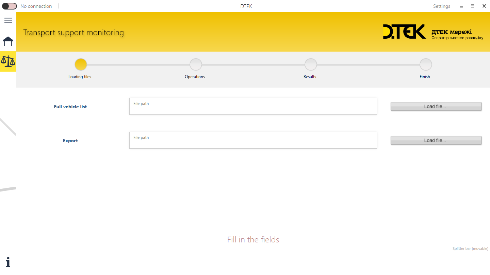
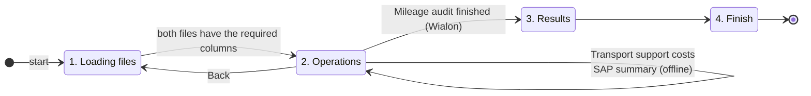
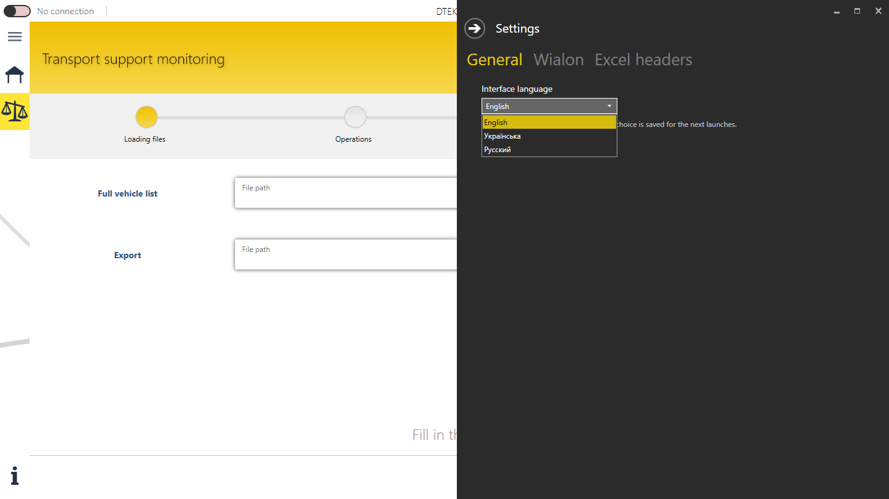
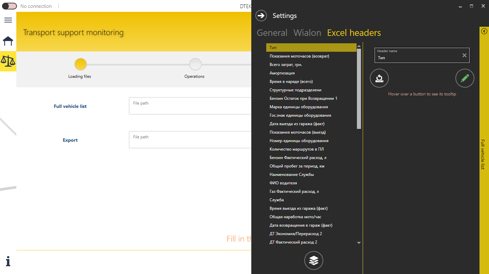

# User guide

A short English version of the built-in guide. To open the original Russian PDF, go to **Help → User guide**.

## Requirements

* Windows with .NET Framework 4.6.1 or later. Windows 10 and 11 already have it.
* The Wialon features need an internet connection, a Wialon access token, and a Wialon account that provides the report the
  audit uses. See [architecture → technical debt](architecture.md#known-technical-debt).

## The screen

* **Top left.** The Wialon connection toggle shows *No connection* or *Connected*. While connected, the app renews the session
  every 14 minutes.
* **Top right.** **Settings**.
* **Left.** The menu: **Home** (a placeholder for now), **Operations** (the wizard; selected at start) and **Help**.
* **Bottom.** A status log of the last 150 events. Hover over most buttons to see a tooltip.

## The Operations wizard

### 1. Loading files

Choose two Excel workbooks in `.xlsx` format. The file dialog also offers `.xls`, but the Excel library reads `.xlsx` only:

| Field | File |
| --- | --- |
| **Full vehicle list** | The vehicles to analyse. It needs at least these columns: license plate, type, service and model. |
| **Export** | The waybills exported from SAP. It needs at least the license plate and total mileage columns. |

**Next** appears once both files exist. The app then checks those required columns against **Settings → Excel headers**. If one
is missing, the error names the file and lists the required columns, and the wizard stays on this step. To see the expected names,
go to **Help → Sample waybill headers**.

> Tip: the vehicle list rarely changes. Set its default path under **Settings → Excel headers → Full vehicle list**.

### 2. Operations

**Operations** tab:

* **Transport support costs** runs offline.
  1. It asks for fuel prices for diesel, gasoline and LPG, from 1 to 1000 UAH per litre.
  2. It totals fuel consumption and cost, mileage and engine hours for each vehicle and each structural unit.
  3. It writes the totals **into the Full vehicle list file** and saves it.
* **Mileage audit** needs Wialon.
  1. Confirm, then choose a period: today, this week, this month or custom.
  2. Choose a simple or a **detailed** report.
  3. Enter the acceptable discrepancy %.
  4. The app fetches each vehicle's trips and speeding from Wialon and compares them with the waybills.
  5. It asks where to save the Excel report and offers to open it.

  **Next** goes to the results only after a mileage audit.

**SAP summary** tab: press **Initialize** to get dashboards built from the waybills only.

* **Mileage**: pie charts of the top 10 vehicles by mileage and by average km per trip. You can switch to the bottom 10,
  show only the vehicles that are in both top-10 lists, and filter by vehicle type. Click a slice to see that vehicle's details.
* **Drivers**: a chart of up to 20 drivers. Six metrics are available: mileage, productivity, average trip, number of trips,
  longest trip and shortest trip. The tab also has statistics tiles and a searchable list. Select a driver to see their daily
  mileage and working days. The **(i)** help explains how productivity is calculated.

### 3. Results

* **Summary** is a grid that you can filter on every column. It shows each vehicle's differences in trips and mileage, the
  number of speeding violations and the discrepancy.
* **Comparison** is filled for a detailed report only.
  * The vehicle list has a search box, a type filter, and the options *Hide vehicles with no mileage* and *Show only vehicles
    with violations*.
  * Pick a vehicle to see its daily SAP and Wialon mileage chart and its details.
  * **Violations** lists every speeding event; each one is shown on a speed gauge.

### 4. Finish

You are done and can close the app.

## Help

**User guide** and **Sample waybill headers** copy the PDF guide and the sample Excel file to your *Downloads* folder and open
it in Explorer.

## The mileage audit report

The report is an Excel workbook. Vehicles are sorted with the largest discrepancy first, and the header of the main sheet is
frozen. The sheet and column names follow the UI language at the time of export.

| Sheet | Contents |
| --- | --- |
| **Odometer reading difference** | One row per vehicle: SAP and Wialon mileage and trips, discrepancy % and the number of speeding violations. In the detailed report, each vehicle row (shaded) has collapsible trip rows with the SAP and Wialon times, locations and driver. |
| **Waybill but no mileage** | Vehicles from the *Full vehicle list* that are not found in Wialon. The tracker may be missing, or the unit is named differently. |
| **Mileage but no waybill** | Wialon units that are not in the *Full vehicle list*: their id and license plate. |

Cells are highlighted when the difference is over the tolerance you entered:

| Cell | Colour | Meaning |
| --- | --- | --- |
| Discrepancy % (per vehicle, or per trip in the detailed report) | 🟨 yellow | Wialon km > SAP km. The waybill values may be too low. |
| Discrepancy % (per vehicle, or per trip in the detailed report) | 🟥 red | SAP km > Wialon km. The tracker may be faulty, or the waybill values too high. |
| Speeding violations *(simple report)* | light red | The vehicle has violations. |
| Trips (Wialon) *(simple report)* | 🟥 red | SAP shows more trips than Wialon; not every trip was tracked. |

## Settings

| Tab | What you can do |
| --- | --- |
| **General** | Interface language (English, Українська, Русский). The switch is immediate, and the choice is remembered. |
| **Wialon** | *Get a token* plus **Next** opens step-by-step instructions. *I already have a token* lets you paste a token; the app checks it and keeps the old one if the new one is invalid. |
| **Excel headers** | Rename any expected column (hover over a name to see its id), reset one name or all of them, and set the default vehicle-list file. The changes are saved when you close the app normally. |

| General | Excel headers |
| --- | --- |
|  |  |

The header names are SAP's own column names, so they stay in Russian in every UI language.

## Troubleshooting

| Problem | What to do |
| --- | --- |
| The files loaded, but **Next** shows an error | The error names the file and its required columns. Rename the columns as in *Help → Sample waybill headers*, change the expected names in *Settings → Excel headers*, or export the waybills from SAP again. |
| Connecting to Wialon takes long or fails | Check the internet connection and try again later; the Wialon server may be unavailable. If that does not help, get a new token in *Settings → Wialon*. |
| The Wialon values in the report are empty | The Wialon account must provide the report template the app uses. See [technical debt](architecture.md#known-technical-debt). |
